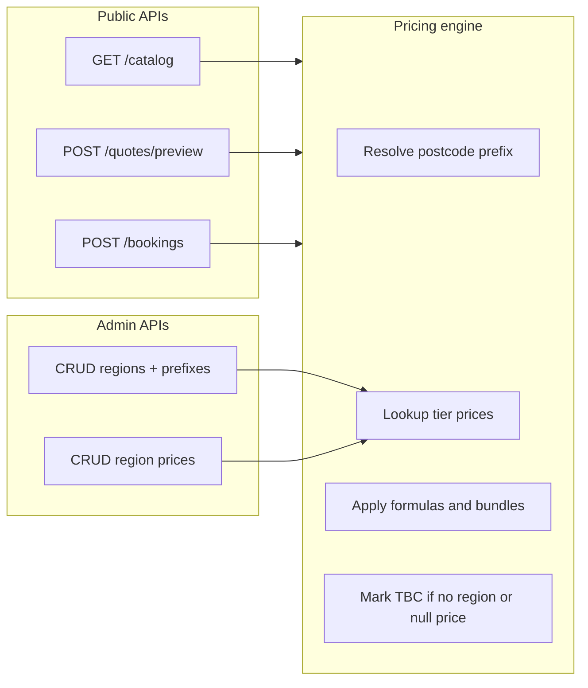

# Landlord booking catalog, region pricing, and quote API

## Context

- Backend today: Express + Sequelize + PostgreSQL, single [`User`](c:\Users\amir.javed\Work\backend\LandlordSafetyBackend\src\models\User.js) model, roles `superAdmin` / `admin` / `technician` — no booking or pricing ([explore summary](c:\Users\amir.javed\Work\backend\LandlordSafetyBackend)).
- You chose **backend + seeds only** (frontend later) and **full price matrix per region** (every tier/option price set per region; unmatched postcode → **TBC**).
- Source of truth for catalog/logic: [Residential booking form.pdf](c:\Users\amir.javed\Documents\Residential booking form.pdf) and [Commercial & Installation get a quote form.pdf](c:\Users\amir.javed\Documents\Commercial & Installation get a quote form.pdf). Use [LSI_Instant_Quote_Calculator.html](c:\Users\amir.javed\Downloads\LSI_Instant_Quote_Calculator.html) as the **UI contract** for a future frontend (4 steps, live quote panel, bundles) — but fix known gaps vs PDF (e.g. EICR+PAT: PDF uses £49.99 PAT when bundled + £10 total discount, not only a flat −£20 line).



---

## 1. Data model (new Sequelize models)

Register in [`src/models/index.js`](c:\Users\amir.javed\Work\backend\LandlordSafetyBackend\src\models\index.js).

| Entity | Purpose |
|--------|---------|
| `PropertyType` | `residential`, `commercial`, `installation` |
| `ServiceCategory` | Gas, Electrical, Fire Safety, EPC, Other, Installation-Electrical, etc. |
| `Service` | Catalog item: `code`, `name`, `propertyTypes[]`, `pricingMode` (`instant`, `quote_only`, `starts_from`), `displayOrder`, `metadata` (icons, ribbon text) |
| `ServiceQuestion` | Dynamic form fields: `fieldKey`, `inputType`, `label`, `options` JSON, `validation`, `conditionalLogic` JSON, `sortOrder` |
| `PricingTier` | Atomic price key: `tierKey` (unique), `serviceId`, `label`, `sortOrder`, `isTbcByDefault` |
| `PricingRule` | Non-matrix logic: `ruleType` (`base_plus_step`, `bundle_discount`, `pat_tiered`, `global_charge`), `config` JSON referencing `tierKey`s |
| `Bundle` | `bundleKey`, component `service` codes, `discountAmount`, `label`, mutual-exclusion group |
| `Region` | `name`, `isActive`, `sortOrder` |
| `RegionPostalPrefix` | `regionId`, `prefix` (normalized uppercase, no spaces; e.g. `SW1A`, `SW1`, `E1`) |
| `RegionPrice` | `regionId`, `pricingTierId`, `amount` DECIMAL nullable — **null = TBC for that tier in that region** |
| `Booking` | Customer + appointment snapshot: contact, `propertyType`, `postcode`, `resolvedRegionId` nullable, Step 3 fields (congestion, parking, date, slot, access), `status`, `pricingStatus` (`priced` / `partial_tbc` / `all_tbc`) |
| `BookingLineItem` | `description`, `subDescription`, `quantity`, `unitPrice`, `total`, `isTbc`, `pricingTierId` nullable, `isDiscount` |
| `BookingAnswer` | `serviceId`, `answers` JSONB |
| `QuoteRequest` | Same shape as booking for commercial/installation **SUBMIT QUOTE REQUEST** (no instant total required) |

**Postcode resolution** ([`src/services/pricing/regionResolver.js`](c:\Users\amir.javed\Work\backend\LandlordSafetyBackend\src\services\pricing\regionResolver.js)):

1. Normalize UK postcode (uppercase, single space).
2. Generate candidate prefixes from outward code (e.g. `SW1A 1AA` → `SW1A`, `SW1`, `SW`).
3. Longest matching active `RegionPostalPrefix` wins.
4. No match → `resolvedRegion = null` → engine returns **`priceStatus: 'tbc'`** on every priced line (per your requirement).

**Config flag**: `VAT_ENABLED` in [`src/config/env.js`](c:\Users\amir.javed\Work\backend\LandlordSafetyBackend\src\config\env.js) (default `false`); quote response includes VAT line £0.00 when off.

---

## 2. Pricing engine (server-side mirror of PDF + HTML)

New module: [`src/services/pricing/quoteCalculator.js`](c:\Users\amir.javed\Work\backend\LandlordSafetyBackend\src\services\pricing\quoteCalculator.js).

**Input**: `propertyType`, `postcode`, selected `services[]` each with `code` + `answers` + optional `bundleKeys[]`, Step 3 flags (`congestionZone`, `parkingAvailable`).

**Output** (matches billing table in PDF §5):

```json
{
  "resolvedRegion": { "id", "name" } | null,
  "lines": [{ "name", "sub", "quantity", "unitPrice", "total", "isTbc", "isDiscount" }],
  "subtotal": null,
  "vat": 0,
  "total": null,
  "pricingStatus": "priced" | "partial_tbc" | "all_tbc"
}
```

**Residential instant rules to implement** (all tier amounts loaded from `RegionPrice`):

| Service | Tier keys / rules (seed all keys per region) |
|---------|-----------------------------------------------|
| GSC (CP12) | `gsc_meter_1` … `gsc_meter_5`; CO install `co_alarm_install` |
| Boiler | `boiler_basic_standalone`, `boiler_full_standalone`, `boiler_basic_bundle_addon`, `boiler_full_bundle_addon` |
| EICR | `eicr_studio`, `eicr_bed_1_3`, `eicr_bed_4` … `eicr_bed_8`; fuse board extras `eicr_board_2` … `eicr_board_4` |
| PAT | `pat_flat_1_10`, `pat_per_extra_appliance`, `pat_with_eicr_1_10` |
| FSC / ELC / FRA | base tiers + step rules (`fsc_alarm_4` = +£20, etc.) per PDF |
| EPC | beds 1–6 priced; `epc_bed_7_plus` → **TBC** |
| Floor plan | bed/floor matrix per PDF |
| Asbestos | `asbestos_house_3bed` only fixed; other → **TBC** |
| Bundles | `bundle_gsc_boiler`, `bundle_eicr_pat`, `bundle_fsc_elc`, `bundle_fsc_elc_fra`, `bundle_epc_floorplan` as negative line tiers |
| Global | `congestion_charge` (+18), `parking_charge` (+5) |

**Commercial / Installation**: `pricingMode = quote_only` — catalog + questions seeded; quote API returns line items with `startsFrom` where PDF specifies (CP17 £199.99, CP44 £250, etc.) but **no totals**; booking stored as `quote_request` status.

**Commercial gas detail** (from Commercial PDF): parent **CGSC** with sub-certificates **CP17, CP42, CP15, CP44** — each with full question sets, merged boiler block when CP17+CP15, CP44 appliance checklist with qty 1–20, catering property type at top.

**Commercial electrical** (same PDF): Commercial EICR, PAT, CFSC, CELC, FRA, CEPC, Floor Plan, Asbestos — all questions in seed.

**Installation/Repair** (PDF pp. 11–13): categories Electrical / Gas / Fire with sub-services (e.g. fuse board: 6-way, 6–10-way, skeleton board + comment boxes); `starts_from` tiers where given (£699.99 electrical, £2999 gas boiler, £220 cooker, fire alarm £239.99/alarm, etc.).

---

## 3. API surface

Follow existing patterns: routes → controller → service → `sendSuccess`, validators, `requireMinRole(ROLES.ADMIN)` for admin.

### Public (no auth) — for future book-now page

| Method | Path | Description |
|--------|------|-------------|
| GET | `/api/catalog` | Query `propertyType` → categories, services, questions, bundles, `pricingMode` |
| POST | `/api/quotes/preview` | Body: selections + postcode → quote lines + totals/TBC |
| POST | `/api/bookings` | Residential: persist booking + line items + answers |
| POST | `/api/quote-requests` | Commercial / Installation submit |

### Admin (`admin`+)

| Method | Path | Description |
|--------|------|-------------|
| GET/POST/PUT/DELETE | `/api/regions` | Region CRUD |
| PUT | `/api/regions/:id/prefixes` | Replace prefix list |
| GET | `/api/regions/:id/prices` | Full matrix for region |
| PUT | `/api/regions/:id/prices` | Bulk upsert tier prices (null = TBC) |
| GET | `/api/bookings` | List/filter bookings and quote requests |

Optional later: `landlord` role + authenticated booking history — **out of scope** for this pass (public book-now flow).

---

## 4. Seeding (no data skipped)

New scripts (run after `db:sync`):

| Script | Content |
|--------|---------|
| [`src/scripts/seedCatalog.js`](c:\Users\amir.javed\Work\backend\LandlordSafetyBackend\src\scripts\seedCatalog.js) | **All** services, questions, bundles, pricing tiers, rules from both PDFs (residential §3.1–3.8, commercial gas/electrical blocks, installation §6.2 + pp. 11–13) |
| [`src/scripts/seedRegionsLondon.js`](c:\Users\amir.javed\Work\backend\LandlordSafetyBackend\src\scripts\seedRegionsLondon.js) | Example London regions + outward prefixes (WC, EC, SW, SE, N, E, W, NW, etc.) |
| [`src/scripts/seedRegionPricesDefault.js`](c:\Users\amir.javed\Work\backend\LandlordSafetyBackend\src\scripts\seedRegionPricesDefault.js) | Full matrix for default region using PDF/HTML amounts; explicit **null** for TBC tiers (EPC 7+, asbestos other, commercial quote-only tiers) |

Add npm script: `npm run db:seed:catalog` (idempotent upserts by `code` / `tierKey`).

**Validation checklist** (automated test file recommended):

- Residential: every service in HTML Step 2 exists in seed with questions.
- Every dropdown option in residential PDF maps to a `PricingTier` or rule step.
- Commercial: CP17/42/15/44 + merged boiler logic fields present.
- Installation: all sub-services from PDF (fuse board variants, gas/fire lists) present.
- Bundle discounts match PDF §7.3.

---

## 5. Frontend (deferred) — contract for later

When you add a frontend, implement the same 4 steps as [LSI_Instant_Quote_Calculator.html](c:\Users\amir.javed\Downloads\LSI_Instant_Quote_Calculator.html):

1. **Your Details** — name, phone, email, postcode, property type (residential / commercial / installation).
2. **Services** — render from `GET /catalog`; sub-questions from catalog; call `POST /api/quotes/preview` on change.
3. **Booking** — pre-fill from step 1; congestion (+£18), parking (+£5), date, slot, access logic.
4. **Summary** — display API lines; **BOOK NOW** vs **SUBMIT QUOTE REQUEST** by `propertyType`; show **TBC** where `isTbc`.

Styling: reuse HTML CSS variables (navy/gold/cream) as reference.

---

## 6. Implementation order

1. Models + associations + `syncModels`
2. `seedCatalog.js` (largest piece — residential + commercial + installation complete)
3. `regionResolver` + `quoteCalculator` + unit tests against PDF examples (GSC+Full boiler bundle = appliance price + £120, etc.)
4. `seedRegionsLondon.js` + `seedRegionPricesDefault.js`
5. Public catalog + quote + booking routes
6. Admin region/matrix routes
7. README API section + example payloads for frontend team

---

## 7. Risks and decisions (documented in code)

| Topic | Decision |
|-------|----------|
| HTML vs PDF pricing | **PDF wins**; HTML used for UX flow only |
| DB migrations | Continue `sequelize.sync({ alter: true })` in dev; note production may need formal migrations later |
| Invoice / email | v1: persist booking only; invoice/email hooks stubbed (`postBookingActions` service) per PDF §7.4 |
| Commercial “starts from” | Stored as `RegionPrice` or `Service.metadata.startsFrom` for display; totals remain quote-only |

---

## Key files to add/change

- New: `src/models/*` (10–12 models), `src/services/pricing/*`, `src/services/booking.service.js`, `src/services/region.service.js`
- New: `src/routes/catalog.routes.js`, `quote.routes.js`, `booking.routes.js`, `region.routes.js`
- New: `src/scripts/seedCatalog.js`, `seedRegionsLondon.js`, `seedRegionPricesDefault.js`
- Update: [`src/routes/index.js`](c:\Users\amir.javed\Work\backend\LandlordSafetyBackend\src\routes\index.js), [`package.json`](c:\Users\amir.javed\Work\backend\LandlordSafetyBackend\package.json), [`README.md`](c:\Users\amir.javed\Work\backend\LandlordSafetyBackend\README.md)
